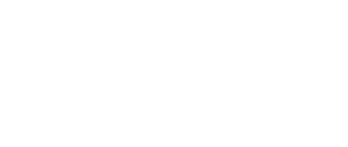
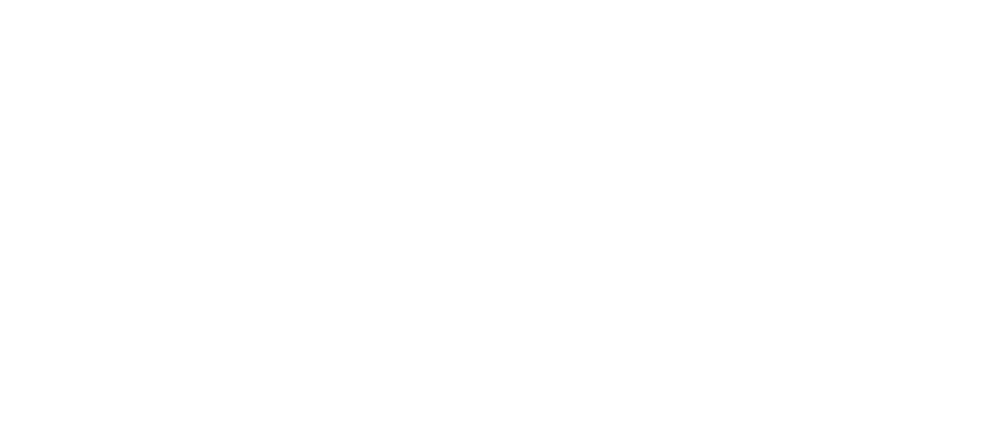
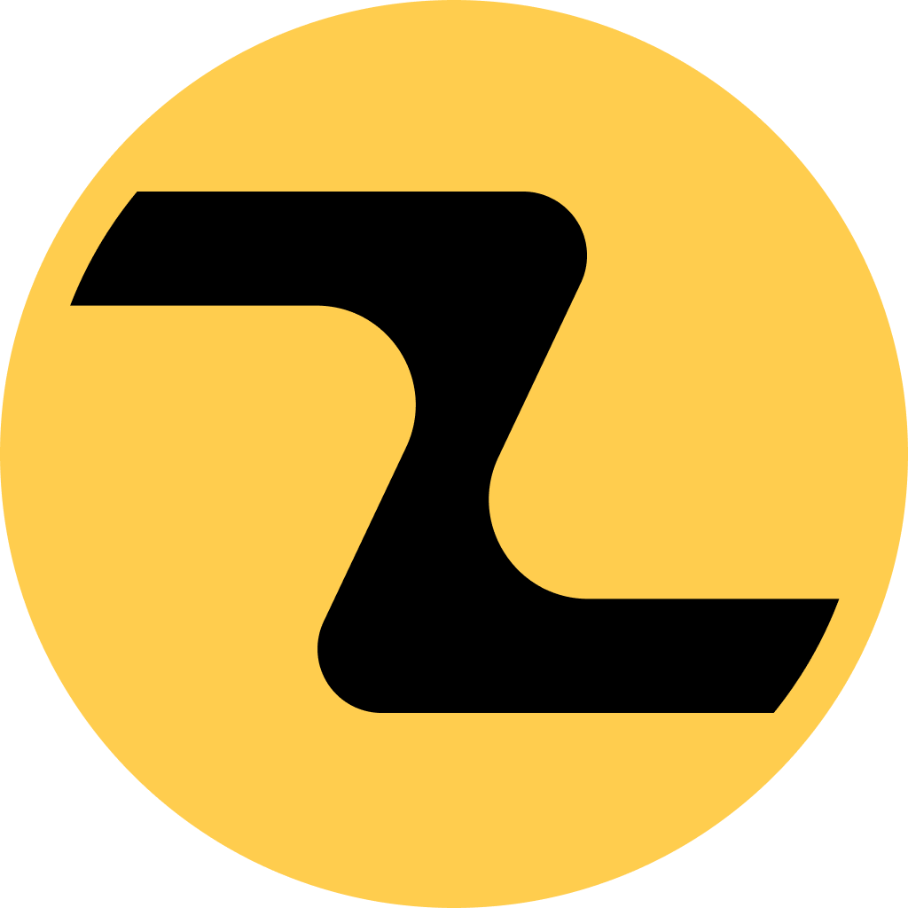

---

# What is zenyx?

Zenyx is a game engine built on top of [wgpu](https://github.com/gfx-rs/wgpu)
and [winit](https://github.com/rust-windowing/winit). It is designed to be an
intuitive and innovative game engine that can both adapt to your workflow and
bring new ideas to the table.

## Features

> 🚀 Note: The following features are goals and are not currently implemented:
> Zenyx

### **Zenyx aims to provide:**

- ✨ **Cross platform support** - Windows, Linux and macOS support
- 🎮 **Support for multiple renderers** - Zenyx can use Vulkan. OpenGL, and
  DirectX. In both 2D and 3D
- ⚡ **Safe Performance** - Written in Rust for speed and safety
- 🎯 **Intuitive Design** - User-friendly workflows and highly extensible tools
- 📝 **Flexible Scripting** - Easy to use scripting language without sacrificing
  performance
- 🔧 **Extensible Architecture** - Modular design for easy customization
- 🛠️ **Fully Featured Toolset** - Built in tools for playing spatial audio and
  level editing
- 🖥️ **Real-time Editor** - Live preview and Incredible User experience
- 📦 **Asset Management** - Efficient resource handling system
- 🎲 **Physics Integration** - Built-in physics simulation
- 🗂️ **Improved Scene Management** - Flexible scene organization tools

## Star history ⭐

<a href="https://star-history.com/#Caznix/Zenyx&Date">
 <picture>
   <source media="(prefers-color-scheme: dark)" srcset="https://api.star-history.com/svg?repos=Caznix/Zenyx&type=Date&theme=dark" />
   <source media="(prefers-color-scheme: light)" srcset="https://api.star-history.com/svg?repos=Caznix/Zenyx&type=Date" />
   
 </picture>
</a>

## FAQ

<b>What platforms does Zenyx support?</b>

Zenyx primarily supports Windows and Linux, with secondary support for macOS
(requires MoltenVK). See the
[Platform support table](#what-platforms-will-be-supported) for more
information.

<b>Is Zenyx ready for production use?</b>

Zenyx is currently in early development and is not yet ready for any simple use
cases, but we're working hard to make it the best it can be before we release
1.0. If this interests you and you're interested in helping, please check out
the [contribution section](CONTRIBUTING.md) for the ways you can help.

<b>How can I contribute to Zenyx?</b>

We welcome contributions! Please check our contribution guidelines and open a
pull request on GitHub, if you arent a developer, you can also report bugs or
feature requests on our [issue tracker](https://github.com/Caznix/Zenyx/issues).
For more information, please see the [Contributing section](#contributing).

<b>What are the system requirements?</b>

Detailed system requirements will be provided as the engine matures. Currently,
the only requirement is a modern OS and a system with atleast a semi-recent GPU.

<b>Is Zenyx free to use?</b>

Yes, Zenyx is open-source software licensed under MIT. You can Modify,
Distribute, and use Zenyx for any purpose you wish.

## What platforms will be supported in the future?

|  Platform  | Support Priority | Status | Notes                                                                                                                                                                                                                                 |
| :--------: | :--------------: | :----: | ------------------------------------------------------------------------------------------------------------------------------------------------------------------------------------------------------------------------------------- |
|  Windows   |     Primary      |   ✅   |                                                                                                                                                                                                                                       |
| Linux/*BSD |     Primary      |   ✅   |                                                                                                                                                                                                                                       |
|   macOS    |    Secondary     |   🌋   | Requires MoltenVK for both editor and exported games due to Wgpu's lack of support for Metal                                                                                                                                          |
|  Android   |       TBD        |   ❓   |                                                                                                                                                                                                                                       |
|    iOS     |       TBD        |   ❓+🌋   |                                                                                                                                                                                                                                       |
|    Web     |       TBD        |   ❓   |                                                                                                                                                                                                                                       |
|  Consoles  |   Not planned    |   ⛔   | Consoles require specific dev kits,proprietary licenses, and substantial fees that we (Caznix & the open source contributors) currently do not have the capacity for. This may change in the future but most likely will not be soon. |

# Documentation

## Getting Started

Zenyx is not yet ready to be used but this may change in the near future.

# Contributing

We welcome contributions of any kind! If you're interested in contributing,
please check out our CONTRIBUTING.md file for coding standards and guidelines.

Even if you're not a developer, you can still help tremendously by spreading the
word about Zenyx, reporting bugs, suggesting features, or helping improve our
documentation.

If you would like to contribute code to Zenyx, follow the instructions below for
your platform:

## Prerequisites (all platforms)

0. Install [Rust](https://www.rust-lang.org/tools/install)

1. Install [git](https://git-scm.com/downloads)

## Building

**1**. Clone the repository:

    git clone https://github.com/Caznix/Zenyx.git

**2**. cd into the project directory

    cd ./Zenyx

**3**. Build the project

    cargo run

## macOS

⚠️ as of this current time, we do not have any macOS contributors to write this
guide, so follow the [General](#building) instructions and try to fill in the
gaps, you can also ask questions on the [Discord]()

## Subcrates
Zenyx is split into multiple crates to make it easier to maintain and update, you can find the crates in the `subcrates` directory, each crate has its own README file so you can find more information for each  crate there. Here is a list of the crates:

* [Zephyr (ECS)](subcrates/zephyr/README.md)
  * Aims to provides a lightweight and boilerplate-free ECS framework for modular game development.
# Press kit

## Typefaces

Main typeface

## Colored badges

